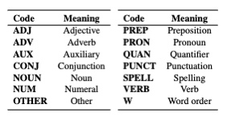

# MuCGEC: A Multi-Reference Multi-Source Evaluation Dataset for Chinese Grammatical Error Correction & SOTA Models


[English](README.en.md) | 简体中文

## 引用
如果您认为我们的工作对您的工作有帮助，请引用我们的论文：

#### MuCGEC: a Multi-Reference Multi-Source Evaluation Dataset for Chinese Grammatical Error Correction (Accepted by NAACL2022 main conference) [[PDF]](https://arxiv.org/pdf/2204.10994.pdf)

```
@inproceedings{zhang-etal-2022-mucgec,
    title = "{MuCGEC}: a Multi-Reference Multi-Source Evaluation Dataset for Chinese Grammatical Error Correction",
    author = "Zhang, Yue and Li, Zhenghua and Bao, Zuyi and Li, Jiacheng and Zhang, Bo and Li, Chen and Huang, Fei and Zhang, Min",
    booktitle = "Proceedings of NAACL-HLT",
    year = "2022",
    address = "Online",
    publisher = "Association for Computational Linguistics"
```

## 简介

给定一段中文文本，中文语法纠错(Chinese Grammatical Error Correction, CGEC)技术旨在对其中存在的拼写、词法、语法、语义等各类错误进行自动纠正。该技术在教育、新闻、通讯乃至搜索等领域都拥有着广阔的应用空间。

目前的中文语法纠错评测集存在着数据量小，答案少，领域单一等缺陷。为了提供更加合理的模型评估结果，本仓库提供了一个高质量、多答案CGEC评测数据集**MuCGEC**。与此同时，为了推动CGEC领域的发展，我们还额外提供了如下资源：

+ **中文语法纠错数据标注规范`./guidelines`**：我们详细定义了常见的中文语法错误的类别体系，针对每类错误，给出了对应的修改方案和丰富的修改样例，从而可以促进中文语法纠错数据标注领域的研究。
+ **中文语法纠错评测工具`./scorers`**：
  + `ChERRANT`：我们对目前英文上通用的可细分类别评估的评测工具[ERRANT](https://github.com/chrisjbryant/errant)进行了中文适配和修改，并命名为`ChERRANT`(**Ch**inese **ERRANT**)。ChERRANT支持字、词粒度的评估。字级别的ChERRANT指标是MuCGEC数据集主要使用的评测指标，缓解了中文上因为分词错误导致的评估不准确现象。词粒度的评估支持更细的错误类型（如拼写错误、名词错误、动词错误等），可供研究人员更好地分析模型。
+ **中文语法纠错基线模型`./models`**：
  + **Seq2Edit模型`./models/seq2edit-based-CGEC`**：设计编辑动作标签（如替换、删除、插入、调序等），从而将语法纠错任务视作序列标注任务进行解决。
    + 我们对英文上SOTA的Seq2Edit模型[GECToR](https://github.com/grammarly/gector)进行了一些修改，以使其支持中文。
  + **Seq2Seq模型`./models/seq2seq-based-CGEC`**：将语法纠错看做是一个从错误句子翻译为正确句子的过程，利用先进的神经机器翻译模型进行解决。
    + 我们微调了大规模Seq2Seq预训练语言模型[中文BART](https://github.com/fastnlp/CPT)用于语法纠错任务。
  + **集成模型`./scorers/ChERRANT/emsemble.sh`**：我们提供了一种简单的基于编辑的模型集成方法，支持异构模型（如Seq2Seq和Seq2Edit）的融合。
+ **中文语法纠错常用工具`./tools`**：
  + **分词工具**
  + **数据增强** (*Todo*)
  + **数据清洗** (*Todo*)

## MuCGEC数据集

我们的数据主要来自中文二语学习者，分别采样自以下数据集：`NLPCC18`测试集（来自于NLPCC18-shared Task2评测任务）、`CGED`测试集（来自于CGED18&20评测任务）以及中文`Lang8`训练集（来自于NLPCC18-shared Task2评测任务）。我们从三个数据来源各采样2000-3000句，采用三人随机标注加审核专家审核方式构建测试集。数据的整体统计如下表所示。

| 数据集 | 句子数| 错误句子数(比例) | 平均字数 | 平均编辑数 | 平均答案数 |
| :------- | :---------: | :---------: | :---------: | :---------: |  :---------: |
| **MuCGEC-NLPCC18** | 1996 | 1904(95.4%) | 29.7 | 2.5 | 2.5 |
| **MuCGEC-CGED** | 3125 | 2988(95.6%) | 44.8 | 4.0 | 2.3 |
| **MuCGEC-Lang8** | 1942 | 1652(85.1%) | 37.5 | 2.8 | 2.1 |
| **MuCGEC-ALL** | 7063 | 6544(92.7%) | 38.5 | 3.2 | 2.3 |

相较于之前的CGEC评测集（如NLPCC18和CGED)，MuCGEC拥有更丰富的答案和数据来源。此外，在标注过程中，我们还发现有74句句子因为句意不清等问题无法标注。

更多关于MuCGEC数据集的细节，请参考我们的论文。

**注：我们目前正在筹划基于MuCGEC数据集的评测任务，所以MuCGEC数据集暂时未放出。我们将会放出开发集，并且以公开榜单的形式放出测试集，请耐心等待。**

## CGEC基准模型

### 实验环境安装

我们采用Python 3.8进行实验，通过以下代码可以安装必要的依赖，考虑到Seq2Edit模型的环境和Seq2Seq模型存在一些冲突，需要分别安装两个环境：
```
# Seq2Edit模型
pip install -r requirements_seq2edit.txt

# Seq2Seq模型
pip install -r requirements_seq2seq.txt
```

### 训练数据

我们实验所用训练集为：`Lang8`数据集(来自外语学习网站Lang8）和`HSK`数据集(北语开发的汉语学习考试数据集)中的错误句子，并且对`HSK`数据集上采样5次，过滤掉和我们测试集重复的部分，共计约150万对。

下载方式：
```
cd ./data/train_data
chmod +x download.sh
./download.sh
```

**注：由于HSK数据集的版权问题，暂时无法提供下载链接，我们将在后续的评测任务中开放HSK数据集。Lang8数据集可以从[NLPCC18-shared task2](http://tcci.ccf.org.cn/conference/2018/taskdata.php)的官方页面找到。**

### 模型使用
我们提供了使用模型的流水线脚本，包含预处理-训练-推理的流程，可参考`./models/seq2edit-based-CGEC/pipeline.sh`及`./models/seq2seq-based-CGEC/pipeline.sh`

与此同时，我们也提供了训练后的checkpoint以供测试（下列指标均为精确度/召回度/F0.5值）：

| 模型 | NLPCC18-Official(m2socrer)| MuCGEC(ChERRANT)|
| :-------: | :---------:| :---------: |
| **seq2seq_lang8**[[Link](https://drive.google.com/file/d/1Jras2Km4ScdVB0sx8ePg-PqCmDC4O8v5/view?usp=sharing)] | 37.78/29.91/35.89 | 40.44/26.71/36.67 |
| **seq2seq_lang8+hsk**[[Link](https://drive.google.com/file/d/180CXiW7pDz0wcbeTgszVoBrvzRmXzeZ9/view?usp=sharing)] | 41.50/32.87/39.43 | 44.02/28.51/39.70|
| **seq2edit_lang8**[[Link](https://drive.google.com/file/d/13OAJ9DSThqssl93bSn0vQetetLhQz5LA/view?usp=sharing)] | 37.43/26.29/34.50 | 38.08/22.90/33.62 |
| **seq2edit_lang8+hsk**[[Link](https://drive.google.com/file/d/1ce7t8r3lLUeJ4eIxIg3EpXwHIUE99nk8/view?usp=sharing)] | 43.12/30.18/39.72 | 44.65/27.32/39.62|

下载后，分别解压放入`./models/seq2edit-based-CGEC/exps`和`./models/seq2edit-based-CGEC/exps`即可使用。以上4个模型全部基于`StructBERT`预训练语言模型。

我们在论文中使用的模型融合策略请参考`./scorers/ChERRANT/ensemble.sh`。

### Tips
+ 我们发现在英文上有用的一些trick，在中文上同样有效，例如GECToR的额外置信度trick和Seq2Seq的R2L-Reranking trick，如果您对模型性能要求较高，可以尝试这些trick。
+ 我们发现两阶段训练（先Lang8+Hsk再单独Hsk）所得模型效果相较于单阶段训练效果会有进一步提升，您感兴趣的话可以按照两阶段训练策略重新训练模型。
+ 我们发现基于[中文BART](https://huggingface.co/fnlp/bart-large-chinese)的Seq2Seq模型存在一些改进空间：1）原始中文BART的词表缺少一些常见的中文标点/字符；2）transformers库训练和推理速度较慢，所占显存也较大。我们最近基于[fairseq](https://github.com/pytorch/fairseq)重新实现了一版基于BART的Seq2Seq模型，并加入了一些额外的训练trick，使其效果有了大幅提升（4-5个F值），且训练/推理速度快了3-4倍。该工作后续也将整理并开源。
+ 我们目前提供的基线模型仅使用了公开训练集。关于数据增强技术，可以参考我们之前在CTC2021比赛中的方案[[Link]](https://github.com/HillZhang1999/CTC-Report)，合理构建的人造数据对模型性能有着巨大的提升。

### 模型评估

针对[NLPCC18官方数据集](http://tcci.ccf.org.cn/conference/2018/taskdata.php)，可使用我们的基准模型预测后，通过NLPCC18的官方工具[M2Scorer](https://github.com/nusnlp/m2scorer)进行计算指标。需要注意的是预测结果必须使用PKUNLP工具分词。

针对MuCGEC数据集的相关指标，可以采用我们提供的[ChERRANT](./scorers/ChERRANT)工具进行指标计算。
ChERRANT的相关使用可参考`./scorers/ChERRANT/demo.sh`。对于字级别指标，我们部分参考了[ERRANT_zh](https://github.com/cehinson/ERRANT_ZH)仓库，词级别指标及错误类型划分我们则参考了[原始ERRANT](https://github.com/chrisjbryant/errant)。

**错误类型**
+ 操作级别（字/词粒度）：
  + M(missing)：缺失错误，需要添加缺失字/词
  + R(redundant)：冗余错误，需要删除冗余字/词
  + S(substitute)：替换错误，需要替换错误字/词
  + W(word-order)：词序错误，需要进行调序
  
+ 语言学级别（仅词粒度）：
  + 我们设计了14种主要的语言学错误类型（基本上是根据词性），除拼写错误(SPELL)和词序错误(W)外，还可以根据替换/删除/冗余操作进一步划分，如`形容词冗余错误`可以表示为：R:ADJ
  
    
  

## 相关工作
+ 我们在CTC2021评测中使用了本仓库的一些技术，并且获得了Top1的成绩，相关技术报告可见：[CTC-report](https://github.com/HillZhang1999/CTC-Report)。
+ 我们的基线模型提供在线演示平台：[GEC demo](http://139.224.234.18:5002/) (校外访问可能较慢，请耐心等待)。
+ YACLC中文学习者语料库：[YACLC](https://github.com/blcuicall/YACLC)。
+ NLPCC18中文语法纠错数据集：[NLPCC18](https://github.com/zhaoyyoo/NLPCC2018_GEC)。

## 联系
如果您在使用我们的数据集及代码的过程中遇到了任何问题，可联系 hillzhang1999@qq.com。
